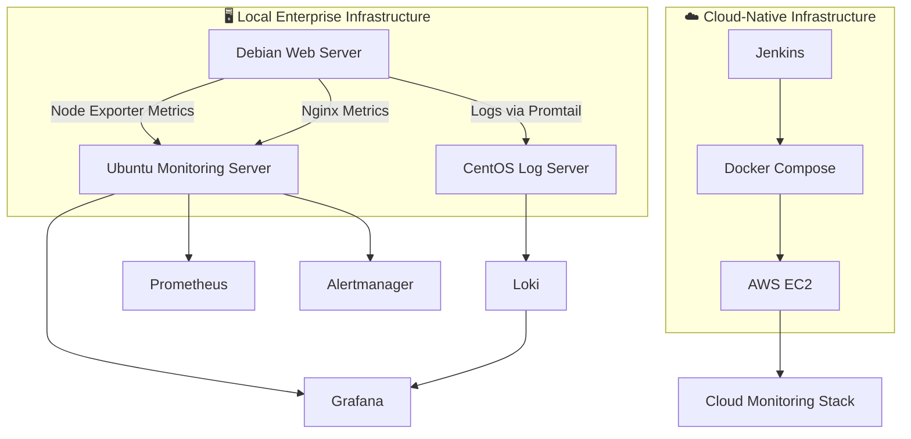

<div align="center">

# 🚀 Cloud-Native Enterprise Infrastructure Monitoring, Log Management & Automation Platform

### Enterprise Observability • Infrastructure Monitoring • Centralized Logging • DevOps Automation • Cloud Deployment

<p align="center">


</p>

**Production-inspired Enterprise Monitoring Platform built using Prometheus, Grafana, Loki, Docker, AWS, Jenkins and Linux.**

</div>

---

# 📖 Project Overview

The **Cloud-Native Enterprise Infrastructure Monitoring, Log Management & Automation Platform** is a complete enterprise observability solution developed to monitor Linux infrastructure, collect system metrics, centralize logs, visualize infrastructure health, generate alerts, and automate deployments using modern DevOps technologies.

The project demonstrates two fully functional deployment environments:

- 🖥️ **Traditional Enterprise Infrastructure** using Linux Virtual Machines
- ☁️ **Cloud-Native Infrastructure** using Docker Compose, AWS EC2, and Jenkins CI/CD

This project combines Linux System Administration, Infrastructure Monitoring, Centralized Logging, Containerization, Cloud Computing, and CI/CD Automation into one enterprise-grade solution.

---

# 🎯 Project Objectives

- Monitor enterprise Linux infrastructure
- Collect real-time infrastructure metrics
- Monitor CPU, Memory, Disk, and Network usage
- Monitor website availability
- Monitor Nginx web server performance
- Centralize system and application logs
- Generate automated alerts
- Visualize infrastructure health using Grafana
- Deploy monitoring services using Docker Compose
- Deploy monitoring platform on AWS EC2
- Automate deployment using Jenkins CI/CD
- Demonstrate enterprise DevOps practices

---

# ✨ Key Features

## 📊 Infrastructure Monitoring

- CPU Monitoring
- Memory Monitoring
- Disk Monitoring
- Filesystem Monitoring
- Network Monitoring
- Host Monitoring

---

## 🌐 Website Monitoring

- Website Availability
- HTTP Health Checks
- Response Time Monitoring
- Blackbox Exporter Integration

---

## 🖥️ Nginx Monitoring

- Active Connections
- HTTP Requests
- Request Rate
- Nginx Exporter Metrics

---

## 📄 Centralized Logging

- Loki Log Aggregation
- Promtail Log Collection
- System Logs
- Application Logs
- Log Visualization

---

## 📈 Dashboard Visualization

- Grafana Dashboards
- Infrastructure Overview
- Resource Utilization
- Real-Time Monitoring
- Performance Analytics

---

## 🚨 Alert Management

- Alertmanager
- Email Notifications
- CPU Alerts
- Memory Alerts
- Disk Alerts
- Website Alerts
- Host Alerts

---

## ☁️ Cloud & Automation

- Docker Compose
- AWS EC2
- Jenkins Pipeline
- CI/CD Automation
- Automated Deployment

---
# 🏗️ Enterprise Architecture

The platform is implemented using **two complete deployment environments**, demonstrating both traditional enterprise infrastructure monitoring and modern cloud-native deployment.

```text
                          Enterprise Monitoring Platform
┌─────────────────────────────────────────────────────────────────────────────┐
│                                                                             │
│     Cloud-Native Enterprise Infrastructure Monitoring Platform              │
│                                                                             │
└─────────────────────────────────────────────────────────────────────────────┘
                                     │
                 ┌───────────────────┴───────────────────┐
                 │                                       │
                 ▼                                       ▼

        🖥️ Local Enterprise Deployment          ☁️ Cloud-Native Deployment

       Ubuntu Monitoring Server                 Docker Compose
       Debian Web Server                        AWS EC2
       CentOS Log Server                        Jenkins CI/CD

       Prometheus                              Prometheus
       Grafana                                 Grafana
       Alertmanager                            Alertmanager
       Blackbox Exporter                       Blackbox Exporter
       Loki                                    Loki
       Promtail                                Promtail
       Node Exporter                           Node Exporter
       Nginx Exporter                          Nginx Exporter

                 │                                       │
                 └───────────────────┬───────────────────┘
                                     ▼

          Enterprise Monitoring • Logging • Alerting • Automation
```

---

# 📌 System Architecture (Mermaid)



---

# 🖥️ Local Enterprise Deployment

The local deployment simulates a real enterprise infrastructure using **three Linux Virtual Machines**.

## 🟠 Monitoring Server (Ubuntu)

### Installed Components

- Prometheus
- Grafana
- Alertmanager
- Blackbox Exporter

### Responsibilities

- Collect infrastructure metrics
- Store monitoring data
- Visualize dashboards
- Generate alerts
- Monitor website availability

---

## 🔵 Web Server (Debian)

### Installed Components

- Nginx
- Node Exporter
- Nginx Exporter
- Promtail

### Responsibilities

- Host web application
- Export system metrics
- Export Nginx metrics
- Forward logs to Loki

---

## 🟢 Log Server (CentOS Stream)

### Installed Components

- Loki
- Promtail
- Node Exporter

### Responsibilities

- Centralized log storage
- Log aggregation
- System monitoring
- Log visualization

---

# ☁️ Cloud-Native Deployment

The cloud implementation provides a containerized monitoring platform deployed on **AWS EC2** using **Docker Compose** with automated deployment through **Jenkins CI/CD**.

## Components

- Docker Compose
- Prometheus
- Grafana
- Alertmanager
- Loki
- Promtail
- Node Exporter
- Nginx Exporter
- Jenkins
- Jenkins Pipeline
- AWS EC2

---

# 🔄 Monitoring Workflow

```text
                Linux Servers
                     │
                     ▼
           Node Exporter
           Nginx Exporter
           Blackbox Exporter
                     │
                     ▼
               Prometheus
                     │
          ┌──────────┴──────────┐
          ▼                     ▼
     Alertmanager          Grafana
          │                     │
          ▼                     ▼
  Email Notifications     Interactive Dashboards
```

---

# 📄 Logging Workflow

```text
Application Logs
System Logs
      │
      ▼
 Promtail
      │
      ▼
    Loki
      │
      ▼
  Grafana
      │
      ▼
Log Visualization
```

---

# 🚨 Alert Workflow

```text
Infrastructure Metrics
         │
         ▼
     Prometheus
         │
 Alert Rules Evaluation
         │
         ▼
   Alertmanager
         │
         ▼
 Email Notifications
         │
         ▼
 System Administrator
```

---

# 📊 Platform Capabilities

| Capability | Local Infrastructure | Cloud Infrastructure |
|------------|----------------------|----------------------|
| Infrastructure Monitoring | ✅ | ✅ |
| Website Monitoring | ✅ | ✅ |
| Centralized Logging | ✅ | ✅ |
| Dashboard Visualization | ✅ | ✅ |
| Automated Alerting | ✅ | ✅ |
| Docker Deployment | — | ✅ |
| AWS Deployment | — | ✅ |
| Jenkins CI/CD | — | ✅ |
| Containerized Services | — | ✅ |

---
# 🛠️ Technology Stack

The platform is built using industry-standard open-source technologies for infrastructure monitoring, centralized logging, visualization, automation, and cloud deployment.

| Category | Technologies |
|-----------|--------------|
| **Operating Systems** | Ubuntu Server, Debian, CentOS Stream |
| **Monitoring** | Prometheus, Node Exporter, Nginx Exporter, Blackbox Exporter |
| **Visualization** | Grafana |
| **Logging** | Loki, Promtail |
| **Alerting** | Alertmanager |
| **Web Server** | Nginx |
| **Containerization** | Docker, Docker Compose |
| **Cloud Platform** | AWS EC2 |
| **CI/CD** | Jenkins |
| **Version Control** | Git, GitHub |
| **Virtualization** | VMware Workstation |

---

# 💡 Skills Demonstrated

This project demonstrates practical experience in the following areas:

### 🐧 Linux Administration

- Ubuntu Server Administration
- Debian Administration
- CentOS Stream Administration
- Linux Service Management
- User and Permission Management
- System Troubleshooting

---

### 📊 Infrastructure Monitoring

- Infrastructure Observability
- Server Health Monitoring
- Performance Monitoring
- Website Monitoring
- Nginx Monitoring
- Metrics Collection

---

### 📄 Log Management

- Centralized Logging
- Log Aggregation
- Log Analysis
- Log Visualization
- System Log Collection

---

### ☁️ Cloud & DevOps

- Docker Containerization
- Docker Compose
- AWS EC2 Deployment
- Jenkins CI/CD
- Infrastructure Automation
- Deployment Pipelines

---

### 🔧 Development Tools

- Git
- GitHub
- Markdown Documentation
- VMware Workstation

---

# 📂 Repository Structure

```text
Cloud-native-Enterprise-Infrastructure-Monitoring-log-management-Automation-Platform
│
├── README.md
├── LICENSE
├── .gitignore
│
├── docs/
│   ├── Architecture.md
│   ├── Installation.md
│   ├── UserGuide.md
│   ├── diagrams/
│   └── screenshots/
│
├── monitoring-server/
│   ├── prometheus/
│   │   ├── prometheus.yml
│   │   ├── alert_rules.yml
│   │   └── recording_rules.yml
│   │
│   ├── grafana/
│   ├── alertmanager/
│   │   └── alertmanager.yml
│   │
│   └── blackbox/
│       └── blackbox.yml
│
├── web-server/
│   ├── nginx/
│   ├── node-exporter/
│   ├── nginx-exporter/
│   └── promtail/
│
├── log-server/
│   ├── loki/
│   │   └── config.yml
│   ├── promtail/
│   └── node-exporter/
│
├── scripts/
│
├── phase-2/
│   ├── docker-compose.yml
│   ├── prometheus/
│   ├── grafana/
│   ├── loki/
│   ├── promtail/
│   ├── nginx/
│   ├── jenkins/
│   └── Jenkinsfile
│
└── screenshots/
```

---

# 📦 Project Deliverables

The project includes the following completed implementations:

- ✅ Enterprise Linux Infrastructure Monitoring
- ✅ CPU, Memory, Disk, and Network Monitoring
- ✅ Website Availability Monitoring
- ✅ Nginx Performance Monitoring
- ✅ Centralized Log Management
- ✅ Interactive Grafana Dashboards
- ✅ Automated Alerting
- ✅ Multi-VM Local Deployment
- ✅ Docker Containerization
- ✅ AWS EC2 Deployment
- ✅ Jenkins CI/CD Pipeline
- ✅ Complete Technical Documentation

---

# 📚 Documentation

The repository contains comprehensive technical documentation for both deployment environments.

| Document | Description |
|----------|-------------|
| 📘 Architecture.md | Complete architecture and workflows |
| ⚙️ Installation.md | Step-by-step installation guide |
| 👨‍💻 UserGuide.md | Usage instructions and verification |
| 📊 Screenshots | Dashboard and deployment images |
| 📁 Configuration Files | Prometheus, Grafana, Loki, Alertmanager, Promtail |
| 📝 Diagrams | Architecture and workflow diagrams |

---

# 📸 Project Gallery

The repository includes screenshots for the following components:

### 🖥️ Local Infrastructure

- Ubuntu Monitoring Server
- Debian Web Server
- CentOS Log Server

### 📊 Monitoring

- Grafana Home Dashboard
- Infrastructure Dashboard
- Node Exporter Dashboard
- Nginx Dashboard
- Prometheus Targets
- Prometheus Graphs
- Prometheus Alerts

### 📄 Logging

- Loki Dashboard
- Grafana Log Explorer
- Promtail Configuration

### 🚨 Alerting

- Alertmanager Dashboard
- Email Alert Notifications

### ☁️ Cloud Deployment

- Docker Compose Services
- Running Containers
- AWS EC2 Instance
- Jenkins Dashboard
- Jenkins Build Pipeline

### 🏗️ Architecture

- Overall Architecture Diagram
- Monitoring Workflow
- Logging Workflow
- Alert Workflow

---

# 🚀 Key Highlights

- Enterprise-grade monitoring platform
- Production-inspired architecture
- Traditional and cloud-native deployments
- Real-time infrastructure monitoring
- Centralized logging solution
- Interactive Grafana dashboards
- Automated alert management
- Docker-based deployment
- AWS cloud implementation
- Jenkins-powered CI/CD automation
- Complete technical documentation
- Professional GitHub repository

---
# 🚀 Quick Start

Follow the documentation in the `docs/` directory to deploy and explore the platform.

### 🖥️ Local Enterprise Deployment

1. Configure the Ubuntu Monitoring Server.
2. Configure the Debian Web Server.
3. Configure the CentOS Log Server.
4. Start Prometheus, Grafana, Loki, Alertmanager, Promtail, and Exporters.
5. Verify metrics, logs, dashboards, and alerts.

### ☁️ Cloud-Native Deployment

1. Launch an AWS EC2 instance.
2. Install Docker and Docker Compose.
3. Clone this repository.
4. Deploy the monitoring stack using Docker Compose.
5. Configure Jenkins and execute the CI/CD pipeline.
6. Verify all monitoring services are running successfully.

---

# ✅ Verification Checklist

After deployment, verify the following:

| Component | Status |
|-----------|:------:|
| Ubuntu Monitoring Server | ✅ |
| Debian Web Server | ✅ |
| CentOS Log Server | ✅ |
| Prometheus Targets | ✅ |
| Grafana Dashboards | ✅ |
| Loki Log Collection | ✅ |
| Promtail Log Shipping | ✅ |
| Alertmanager Alerts | ✅ |
| Website Monitoring | ✅ |
| Node Exporter Metrics | ✅ |
| Nginx Exporter Metrics | ✅ |
| Docker Containers | ✅ |
| AWS EC2 Deployment | ✅ |
| Jenkins Pipeline | ✅ |

---

# 📈 Project Outcomes

This project successfully demonstrates:

- Enterprise infrastructure monitoring
- Centralized log management
- Interactive dashboard visualization
- Automated alert generation
- Website availability monitoring
- Linux server administration
- Docker containerization
- Cloud deployment on AWS EC2
- CI/CD implementation with Jenkins
- Production-inspired DevOps practices

---

# 🌍 Real-World Use Cases

This platform can be adapted for:

- Enterprise Data Centers
- Cloud Infrastructure Monitoring
- DevOps Environments
- Site Reliability Engineering (SRE)
- IT Operations (ITOps)
- Linux Server Monitoring
- Web Application Monitoring
- Log Analysis and Troubleshooting
- Infrastructure Health Monitoring
- Continuous Deployment Environments

---

# 🤝 Contribution

Contributions are welcome.

If you would like to improve this project:

1. Fork the repository.
2. Create a new feature branch.
3. Commit your changes.
4. Push the branch to your fork.
5. Open a Pull Request.

---

# 📝 Documentation Index

| Document | Purpose |
|----------|---------|
| `README.md` | Project overview |
| `docs/Architecture.md` | Architecture and workflows |
| `docs/Installation.md` | Installation and configuration |
| `docs/UserGuide.md` | Usage and verification |
| `docs/diagrams/` | Architecture diagrams |
| `docs/screenshots/` | Project screenshots |
| `monitoring-server/` | Monitoring configuration |
| `web-server/` | Web server configuration |
| `log-server/` | Logging configuration |
| `phase-2/` | Cloud-native deployment |

---

# 📸 Screenshots

> **Replace the placeholders below with actual screenshots after completing the implementation.**

| Screenshot | Description |
|------------|-------------|
| `architecture.png` | Overall system architecture |
| `grafana-dashboard.png` | Grafana infrastructure dashboard |
| `prometheus-targets.png` | Prometheus targets |
| `prometheus-alerts.png` | Active alerts |
| `alertmanager.png` | Alertmanager interface |
| `loki-logs.png` | Centralized logs in Grafana |
| `blackbox-exporter.png` | Website monitoring |
| `node-exporter-dashboard.png` | Node Exporter dashboard |
| `nginx-dashboard.png` | Nginx monitoring dashboard |
| `docker-containers.png` | Running Docker containers |
| `aws-ec2.png` | AWS EC2 deployment |
| `jenkins-pipeline.png` | Jenkins CI/CD pipeline |

---

# 🏆 Key Achievements

- Designed a multi-server enterprise monitoring architecture.
- Implemented infrastructure monitoring with Prometheus.
- Built interactive Grafana dashboards for real-time visualization.
- Centralized log management using Loki and Promtail.
- Configured Alertmanager for automated notifications.
- Monitored web services using Blackbox Exporter and Nginx Exporter.
- Containerized the monitoring stack using Docker Compose.
- Deployed the solution on AWS EC2.
- Automated deployment with Jenkins CI/CD.
- Produced complete technical documentation for installation, architecture, and usage.

---

# 👨‍💻 Authors

**Major Project Team**

**Project Title:**  
**Cloud-Native Enterprise Infrastructure Monitoring, Log Management & Automation Platform**

---

# 📄 License

This project is licensed under the **MIT License**. See the `LICENSE` file for more information.

---

<div align="center">

## ⭐ If you found this project useful, consider giving it a Star!

### Built with ❤️ using Linux, Prometheus, Grafana, Loki, Docker, AWS & Jenkins

**Enterprise Infrastructure Monitoring • Observability • DevOps • Cloud Computing**

</div>
